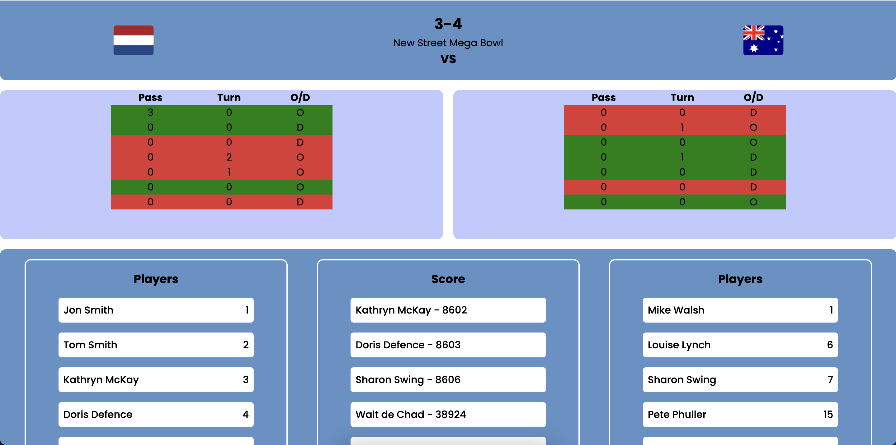

<!-- > _Fork_ deze leertaak en ga aan de slag. Onderstaande outline ga je gedurende deze taak in jouw eigen GitHub omgeving uitwerken. De instructie vind je in: [docs/INSTRUCTIONS.md](docs/INSTRUCTIONS.md) -->

# Pagina voor UltimateTv
<!-- Geef je project een titel en schrijf in één zin wat het is -->

## Inhoudsopgave

  * [Beschrijving](#beschrijving)
  * [Kenmerken](#kenmerken)
  * [Installatie](#installatie)
  * [Gebruik](#gebruik)
  * [Bronnen](#bronnen)
  * [Licentie](#licentie)

## Beschrijving
<!-- In de Beschrijving staat hoe je project er uit ziet, hoe het werkt en wat je er mee kan. -->
<!-- Voeg een mooie poster visual toe 📸 -->
<!-- Voeg een link toe naar Github Pages 🌐-->

  UltimateTv is een bedrijf die frisbee wedstrijden live op Youtube streamt en commentaar geeft tijdens de wedstijd. Mijn opdracht is om een nieuw design te maken van de huidige website. 

  De pagina is te bezoeken via deze link: https://uninterested-bass-hose.cyclic.app/

  User Story:

  

   

  

## Kenmerken
<!-- Bij Kenmerken staat welke technieken zijn gebruikt en hoe. Wat is de HTML structuur? Wat zijn de belangrijkste dingen in CSS? Wat is er met Javascript gedaan en hoe? Misschien heb je een framwork of library gebruikt? -->

## Installatie

## Gebruik

## Bronnen

## Licentie

This project is licensed under the terms of the [MIT license](./LICENSE).
